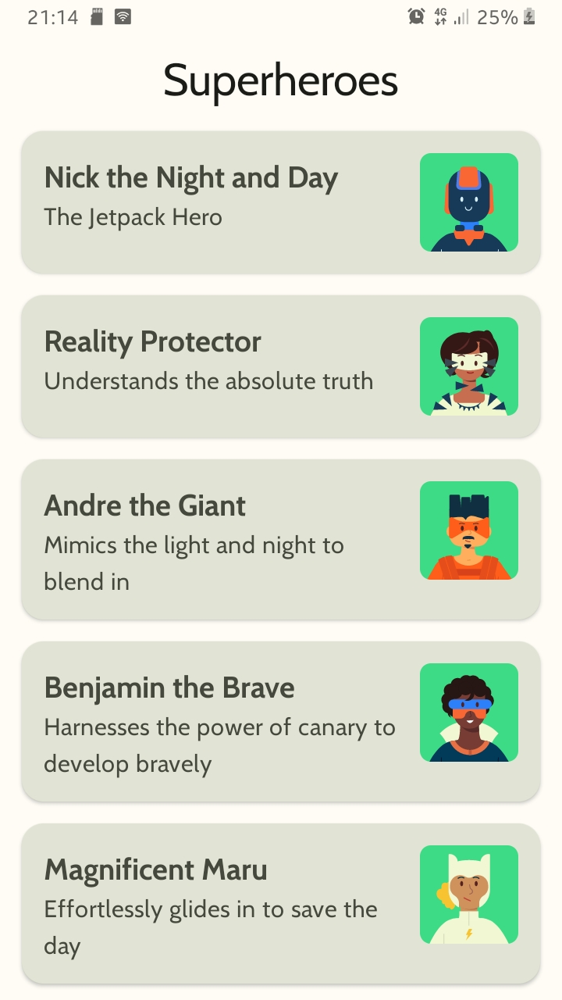
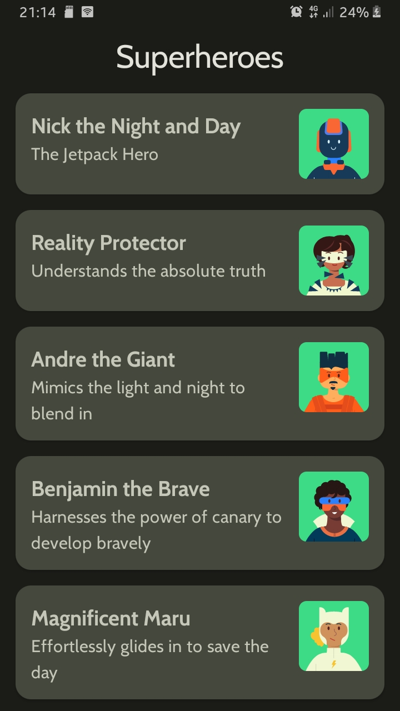

# kotlin-compose-training-superheroes-app
Material theming is used to display a list of superheroes in this app.

## Pre-requisites

- Experience with Kotlin syntax.
- How to create and run a project in Android Studio.
- How to create composable functions
- Familiarity with lazy list

## Previews

<table>
    <tr>
      <td>Light mode</td>
      <td>Dark mode</td>
    </tr>
  <tr>
    <td>
      
    </td>
    <td>
      
    </td>
  </tr>
</table>
